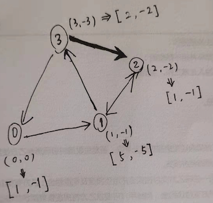

# Getting started with Graph Convolutional Networks as an Amateur

https://zhuanlan.zhihu.com/p/27587371

https://www.cnblogs.com/wangxiaocvpr/p/8306519.html

https://www.cnblogs.com/wangxiaocvpr/p/8299336.html

https://towardsdatascience.com/how-to-do-deep-learning-on-graphs-with-graph-convolutional-networks-7d2250723780

GCN是一种强大的神经网络，旨在直接在图上工作并利用其结构信息。这篇文章是关于如何用图卷积网络（GCN）在图上进行深度学习的系列文章的第一篇。该系列的包含：

1. 本篇：一个高层级的GCN介绍
2. 谱图卷积的半监督学习

## 最基本的代码实现GCN -- 一个高层级的GCN介绍
In this post, I will illustrate how information is propagated through the hidden layers of a GCN using coding examples. 看看GCN是如何从前几层聚合信息的，以及这种机制是如何产生图中节点的有用特征表示的。
[ref link in Chinese中文](https://cloud.tencent.com/developer/article/1400504)

### 看看GCN的输入是啥
Given a graph $G = (V, E)$ , a GCN takes as input:

- adjacency matrix $\mathbf{A}$ of $G$.   *N* × *N* 
- an input feature matrix, $N × F⁰$ feature matrix, $\mathbf{X}$, 
  - where *N* is the number of nodes and
  -  *F⁰* is the number of input features for each node

图示是一个例子

### 对图中示例的解释：

以一个包含4个节点的图为例，圆括号是每个节点的属性信息。有向边（v,n）表示从v->n的边，此时定义n是节点v的邻居。

GCN的隐藏层记作： $H^{i} = f(H^{i-1}, \mathbf{A})$ 

如果将 $f$ 这个传播规则定义为最简单的  $f(\cdot) = \mathbf{A} \times H^{i-1}$ 

$$
\mathbf{A} = \begin{bmatrix} 0&1&0&0 \\ 0&0&1&1 \\0&1&0&0 \\1&0&1&0 \\ \end{bmatrix}
$$

$$
H^{i-1} = \begin{bmatrix} 0&0 \\ 1&-1 \\ 2&-2 \\ 3&-3 \\  \end{bmatrix}
$$

$$
H^{i} = \mathbf{A} \times H^{i-1} = \begin{bmatrix} 1 & -1 \\ 5 & -5 \\ 1 & -1 \\ 2 & -2 \end{bmatrix}
$$

通过一次传播，得到了节点的新的特征$H^i$ .

如果我们还有节点的度矩阵： $D$ ，利用 $D$ 可以对 $H^i$ 进行归一化： $f(X,A) = D^{-1} \mathbf{A} X$ or  $f(X,A) = D^{-1} \mathbf{A} H^{i}$

此例中，$$D = \begin{bmatrix} 1&0&0&0 \\ 0&2&0&0 \\0&0&2&0 \\0&0&0&1 \\ \end{bmatrix}$$

归一化后，上面的 $H^i$ 变为：$ H^i = \begin{bmatrix} 1&-1 \\ 2.5&-2.5 \\ 0.5&-0.5 \\2&-2 \end{bmatrix}$

###  几个问题

**问题1：**该表征是相邻节点的特征聚合， 节点的聚合表征不包含它⾃⼰的特征！只有具有⾃环（self-loop）的节点才会在该聚合中包含⾃⼰的特征。在邻接矩阵A中，对角线上为1的节点才是具有自环的节点。

**问题2：**度⼤的节点在其特征表征中将具有较⼤的值，度⼩的节点将具有较⼩的值。会影响随机梯度下降算法，比如梯度爆炸。

#### 解决：

1. 增加自环，在A中加入eye矩阵：np.eye(A.shape[0])
2. 对表征进行归一化。如：$f(X,A) = D^{-1} \mathbf{A} X$

---

## 2. 整合

这一节要把前面讨论的增加自环、归一化加入，还要加入前面省略的权重和激活函数。

即： 自环 - 归一化 - 权重 - 激活函数

### 2.1 应用权重

一个定义：$\hat{\mathbf{A}} = A + I$ 。 $D$ 是 A 的度矩阵，定义$\hat{D}$ 是 $\hat{\mathbf{A}}$ 的度矩阵。

权重矩阵： $W = \begin{bmatrix} 1&-1 \\ -1&1 \end{bmatrix}$ 

计算此时的属性传播：$\hat{D}^{-1} \times \hat{\mathbf{A}} \times X \times W$

